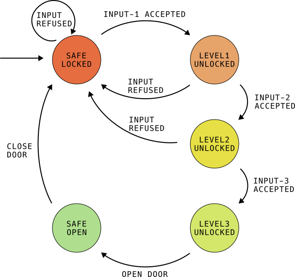

# High security safe

This repo contains all files for the high security safe project for teaching embedded concepts.

## Project description

## HW List

- Nucleo-F401RE
- 4x4 Keypad
- Rotary Encoder (z.. KY-40)

- Some Buttons, LEDs, Resistors for testing

## Block diagram

## State machine

## Resources

# Projektanforderungen:

Sie können dieses repo als Ausgangslage wählen. 
- Am besten erstellen Sie einen Fork von diesem repo. [https://docs.github.com/de/pull-requests/collaborating-with-pull-requests/working-with-forks/fork-a-repo](https://docs.github.com/de/pull-requests/collaborating-with-pull-requests/working-with-forks/fork-a-repo)
- Anschließend clonen Sie ihren Fork und können dann local weiter arbeiten. [https://docs.github.com/de/repositories/creating-and-managing-repositories/cloning-a-repository](https://docs.github.com/de/repositories/creating-and-managing-repositories/cloning-a-repository)

## ABGABE:
- Präsentation + Handout zum Thema (Theorie) 25%
- Live Demo des Themas (Praxis) 25%
- Integration in das Safe Projekt (github link) 25%
- schriftlicher Test zu bisherigem Stand (State Machine, Interrups, Blockdiagrame,keypad,Rotary Encoder, UART) 25% 

## THEMEN/GRUPPEN:

### Allgemein (Gilt für alle Gruppen)
- Die Theorie hinter den Bauteilen soll anschaulich und in einer angemessenen Tiefe vermittelt werden.
- Integration ins Projekt soll über eine eigenen Modul (.h/.cpp) erfolgen, welche die nötigen Funktionen bereitstellt. Wie für Statemachine, Keypad und Rotary Encoder auch bereits geschehen.
- Für HW Aufbauten soll ein Schaltplan vorhanden sein.
- Sie sollten Nachfragen zur Umsetzung beantworten können.

### LED Ring (WS2812b)
Der LED Ring soll folgendermaßen angebunden werden:
- Beim drehen des Rotary Encoders soll für jeden Schritt die nächste (je nach Drehrichtung link/rechts) LED blau leuchten. 
- Es soll keine Endpunkte geben. Man kann also beliebig oft im Kreis drehen.
- Wird der Taster am Rotary Encoder gedrückt soll die aktuelle LED gespeichert werden. Insgesamt sollen 3 LED Positionen gespeichert werden. Nach der dritten soll ausgewertet werden ob die LEDs (3,11,7) ausgewählt wurden. (Hinweis: Stellen Sie sich den Ring als Uhr vor.)
- Ist die Eingabe richtig soll der Ring grün leuchten und das Schloss öffnen. Ist die Eingabe falsch soll der Ring rot leuchten.

### LCD1602 Display
Das Display soll folgendermaßen angebunden werden.

- im 4 Bit Modus
- Wenn der Safe im Locked Modus ist soll eine entsprechende Meldung angezeigt werden.
- Der User soll darauf hingewiesen werden die Pin nun einzugeben.
- Die Zahlen sollen standardmäßig nur als * auf dem Display angezeigt werden, wenn der Benutzer die * Taste gedrückt hält sollen die eingegebenen Zahlen angezeigt werden, sobald er los lässt jedoch wieder verschwinden.
- Mit # wird der Zahlencode bestätigt.
- Ist die Eingabe Richtig wird eine entsprechende Meldung angezeigt und das nächste Schloss geöffnet.
- Ist die Eingabe Falsch wird eine entsprechende Meldung angezeigt und wieder zurück in den Locked Zustand gesprungen.

### Servo mit PWM 
Es gelten folgende Anforderungen:
- 2 Schlösser sollen mit einem Servo Motor umgesetzt werden.
- Eine Konstruktion wie der Servo die Tür schließt muss sich überlegt werden. (3D Druck möglich.)
- Die Arduino Servo Bibliothek soll nicht verwendet werden.
- Die Bibliothek [HWTimers](https://github.com/stm32duino/Arduino_Core_STM32/wiki/HardwareTimer-library) soll verwendet werden.
- Gehen Sie bei der Theorie vor allem auf PWM ein. Timer nur das Grundlegende was nötig ist fürs verständnis. Absprache mit Gruppe Magnetschloss.

### Magnetschloss 

Einbindung eines Magnetschlosses:

- Ansteuerung eines Magnetschloss mit einem MOSFET als Schalter
- Automatischer Timeout mittels Timers (nicht millis). Sie können dafür die Bibliothek [HWTimers](https://github.com/stm32duino/Arduino_Core_STM32/wiki/HardwareTimer-library) verwenden. 
- Theorie soll MOSFET Schaltung und Was sind Timer (Grundlagen Timer am Microcontroller) enthalten. Absprache mit Gruppe Servo hilfreich.

### Entsperrung mit einem RFID Chip

Es gelten folgende Anforderungen.
- Der RFID Chip ist die letzte Stufe der Entriegelung.
- Nur Chips mit bestimmten IDs sollen die Entsperrungzulassen.
- Wird ein falscher Chip for den Leser gehalten soll dies mit einem Piepser signalisiert werden.

### Batteriespannung mit ADC messen.
- Der Microcontroller soll über die Batterie mit Strom versorgt werden. 
- Mit dem ADC soll die Batteriespannung gemessen werden.
- Fällt der Wert unter einen kritischen Wert soll eine LED sowie eine DEBUG Nachricht über UART darüber informieren.
